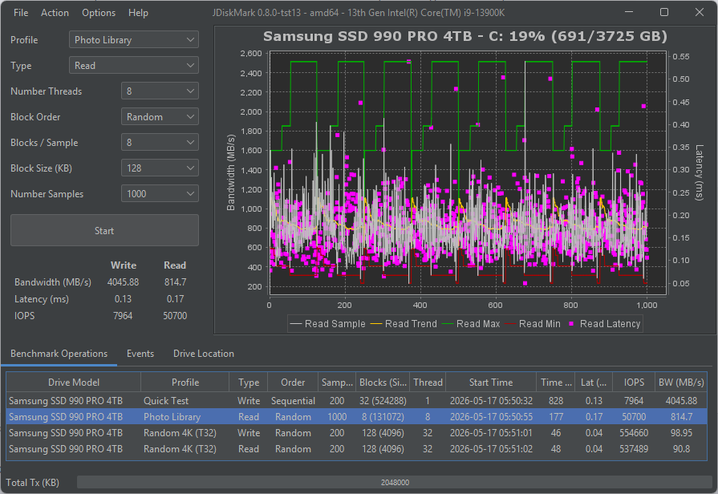

# JDiskMark

**Java Disk Benchmark Utility** — cross-platform disk I/O performance testing for Windows, macOS and Linux.

[](https://github.com/JDiskMark/jdm-java/actions/workflows/windows-msi.yml)
[](https://github.com/JDiskMark/jdm-java/actions/workflows/linux-deb.yml)
[](https://github.com/JDiskMark/jdm-java/actions/workflows/linux-rpm.yml)
[](https://github.com/JDiskMark/jdm-java/actions/workflows/linux-flatpak.yml)
[](https://github.com/JDiskMark/jdm-java/actions/workflows/macos-pkg.yml)
[](https://sourceforge.net/projects/jdiskmark/files/latest/download)
[](LICENSE.md)



## Features

- Java cross platform solution
- Benchmark IO read/write performance
- Graphs: sample bw, max, min, cum bw, latency (access time)
- Configure block size, blocks, samples and other benchmark parameters
- Detect drive model, capacity and processor
- Save and load benchmark
- Auto clear disk cache (when sudo or admin)
- multi threaded benchmarks
- Default profiles
- Command line interface
- Installers for msi, pkg, deb, rpm and flatpak

## Releases

https://sourceforge.net/projects/jdiskmark/

### Windows Installer (.msi)

A signed windows installer is available for windows environment and can be installed as an administrator.

To install launch the `jdiskmark-<version>.msi`.

### Deb Installer (.deb)

The deb installer is used on Debian linux distributions like ubuntu.

To install use `sudo dpkg -i jdiskmark_<version>_amd64.deb` and to remove `sudo dpkg -r jdiskmark`

### RPM Installer (.rpm)

The rpm installer is used on RHEL, CENTOS, SUSELinux and Fedora distributions.

To install use `sudo rpm -i jdiskmark-<rpm.version>.x86_64.rpm` and to remove use `sudo rpm -e jdiskmark`

Note: the `rpm.version` is similar to the `version` but replaces hyphens with periods.

### Flatpak Installer (.flatpak)

The flatpak installer is a universal linux package that can be used on many distributions.
Some gaming-oriented distros such as Bazzite or SteamOS have Flatpak and Flathub 
pre-configured.

#### 1. Add Flathub (if not already configured)

```sh
flatpak remote-add --user --if-not-exists flathub https://flathub.org/repo/flathub.flatpakrepo
```

#### 2. Install the required runtime

JDiskMark depends on the `org.freedesktop.Platform 25.08` runtime. Install it from Flathub:

```sh
flatpak install --user flathub org.freedesktop.Platform//25.08
```

#### 3. Install JDiskMark

Download the `jdiskmark-<version>.flatpak` bundle and run:

```sh
flatpak install --user ./jdiskmark-<version>.flatpak
```

#### 4. Run

Launch JDiskMark from your application menu or the terminal:

```sh
flatpak run net.jdiskmark.JDiskMark
```

#### 5. Uninstall

```sh
flatpak uninstall net.jdiskmark.JDiskMark
```

### Zip Archive (.zip)

> **Note:** The zip distribution is currently disabled in the build pipeline and is planned for restoration in a future release. It is intended as a portable, no-install option — ideal for running from a USB drive on systems where admin rights are not available (e.g. PC repair shops).

The zip distribution does not require admin for installing but does require
Java 25 to be installed separately.

1. Download and install [Java 25](https://www.oracle.com/java/technologies/downloads/) from Oracle.

2. Verify Java 25 is installed:
   ```
   C:\Users\username>java --version
   java 25.0.1 2025-10-21 LTS
   Java(TM) SE Runtime Environment (build 25.0.1+8-LTS-27)
   Java HotSpot(TM) 64-Bit Server VM (build 25.0.1+8-LTS-27, mixed mode, sharing)
   ```

3. Extract release zip archive into desired location.
   ```
   Examples:
   /Users/username/jdiskmark-<version>
   /opt/jdiskmark-<version>
   ```

## Launching as normal process

Note: Running without sudo or a windows administrator will require manually 
clearing the disk write cache before performing read benchmarks.

1. Open a terminal or shell in the extracted directory.

2. run command:
   ```
   $ java -jar jdiskmark.jar
   ```
   In windows double click executable jar file.

3. Drop cache manually:
   - Linux: `sudo sh -c "sync; 1 > /proc/sys/vm/drop_caches"`
   - Mac OS: `sudo sh -c "sync; purge"`
   - Windows: Run included EmptyStandbyList.exe or [RAMMap64.exe](https://learn.microsoft.com/en-us/sysinternals/downloads/rammap)
     - With RAMMap64 invalidate disk cache with Empty > Empty Standby List

## Launching gui with elevated privileges

Note: Take advantage of automatic clearing of the disk cache for write read 
benchmarks start with sudo or an administrator windows shell.

- Linux: `sudo java -jar jdiskmark.jar`
- Mac OS: `sudo java -jar jdiskmark.jar`
- Windows: start powershell as administrator then `java -jar jdiskmark.jar`

## command line examples

display version

```
java -jar jdiskmark.jar -v
```

display top level help

```
java -jar jdiskmark.jar -h
```

display benchmark options

```
java -jar .\jdiskmark.jar run -h
Usage: jdiskmark run [-cdhmsvy] [-a=<sectorAlignment>] [-b=<numOfBlocks>] [-e=<exportPath>]
                     [-i=<ioEngine>] [-l=<locationDir>] [-n=<numOfSamples>] [-o=<blockSequence>]
                     [-p=<profile>] [-t=<benchmarkType>] [-T=<numOfThreads>] [-z=<blockSizeKb>]
Starts a disk benchmark test with specified parameters.
  -a, --alignment=<sectorAlignment>
                            Sector alignment: NONE, ALIGN_512, ALIGN_4K, ALIGN_8K, ALIGN_16K,
                              ALIGN_64K. (Profile default used if not specified)
  -b, --blocks=<numOfBlocks>
                            Number of blocks/chunks per sample. (Profile default used if not
                              specified)
  -c, --clean               Remove existing JDiskMark data directory before starting.
  -d, --direct              Enable Direct I/O (bypass OS cache). Only works with MODERN engine.
  -e, --export=<exportPath> The output file to export benchmark results in json format.
  -h, --help                Display this help and exit.
  -i, --io-engine=<ioEngine>
                            I/O Engine: MODERN, LEGACY. (Profile default used if not specified)
  -l, --location=<locationDir>
                            The directory path where test files will be created.
  -m, --multi-file          Create a new file for every sample instead of using one large file.
  -n, --samples=<numOfSamples>
                            Total number of samples/files to write/read. (Profile default used if
                              not specified)
  -o, --order=<blockSequence>
                            Block order: SEQUENTIAL, RANDOM. (Profile default used if not specified)
  -p, --profile=<profile>   Profile: QUICK_TEST, MAX_THROUGHPUT, HIGH_LOAD_RANDOM_T32,
                              LOW_LOAD_RANDOM_T1, MAX_WRITE_STRESS, MEDIA_PLAYBACK,
                              VIDEO_EXPORTING, PHOTO_LIBRARY. (Default: QUICK_TEST)
  -s, --save                Enable saving the benchmark results to the database.
  -t, --type=<benchmarkType>
                            Benchmark type: READ, WRITE, READ_WRITE. (Profile default used if not
                              specified)
  -T, --threads=<numOfThreads>
                            Number of threads to use for testing. (Profile default used if not
                              specified)
  -v, --verbose             Enable detailed logging.
  -y, --write-sync          Enable Write Sync (flush to disk).
  -z, --block-size=<blockSizeKb>
                            Size of a block/chunk in Kilobytes (KB). (Profile default used if not
                              specified)
```

run benchmarks example syntax

```
java -jar jdiskmark.jar run -n 25 -t "Write"
java -jar jdiskmark.jar run -l D:\ -n 25 -t "Read"
java -jar jdiskmark.jar run -n 25 -t "Read & Write"
java -jar jdiskmark.jar run -p MAX_WRITE_STRESS
```
run example benchmark
```
java -jar jdiskmark.jar run -n 25 -o Random -t "Write" -T 4
...
-------------------------------------------
JDiskMark Benchmark Results (v0.8.0)
-------------------------------------------
Benchmark: Write
Drive: Samsung SSD 990 PRO 4TB
Capacity: 32% (1178/3725 GB)
Timestamp: 2026-05-17T05:50:32.000000000
CPU: 13th Gen Intel(R) Core(TM) i9-13900K
System: Windows 11 / amd64
Java: Java(TM) SE Runtime Environment 25.0.1
Path: C:\Users\username
-------------------------------------------
Order: Random
IOMode: Write
Thread(s): 4
Blocks(size): 25(512)
Samples: 25
TxSize(KB): 409600
Speed(MB/s): 3952.64
SpeedMin(MB/s): 3397.24
SpeedMax(MB/s): 4243.47
Latency(ms): 0.13
IOPS: 28892857
-------------------------------------------
```

## Development Environment

JDiskMark is developed with [NetBeans 25](https://netbeans.apache.org/front/main/download/) and [Java 25](https://www.oracle.com/java/technologies/downloads/).

## Build from Source

### Prerequisites

- [Java 25 JDK](https://www.oracle.com/java/technologies/downloads/)
- [Apache Maven 3.9+](https://maven.apache.org/download.cgi)
- [NetBeans 25](https://netbeans.apache.org/front/main/download/) (recommended IDE)

### Build Commands

| Goal | Command |
|---|---|
| Build core only (fastest) | `mvn clean install -pl jdm-core -am --no-transfer-progress` |
| Full reactor (all modules) | `mvn clean install --no-transfer-progress` |
| Windows MSI (Windows only) | `mvn clean install -pl jdm-core,jdm-dist/jdm-msi -am` |
| Fat DEB, bundled JRE (Linux only) | `mvn clean install -pl jdm-core,jdm-dist/jdm-deb -am -Plinux-deb` |
| Slim DEB, system JRE (Linux only) | `mvn clean install -pl jdm-core,jdm-dist/jdm-deb-slim -am -Plinux-deb-slim` |
| RPM (Linux only) | `mvn clean install -pl jdm-core,jdm-dist/jdm-rpm -am -Plinux-rpm` |
| Flatpak (Linux only) | `mvn clean install -pl jdm-core,jdm-dist/jdm-flatpak -am -Plinux-flatpak` |
| macOS PKG (macOS only) | `mvn clean install -pl jdm-core,jdm-dist/jdm-pkg -am` |

See [CONTRIBUTING.md](CONTRIBUTING.md) for more details.

## Source

Source is available on our [GitHub repo](https://github.com/JDiskMark/jdm-java/).

## Issues & Contributing

Bug reports and pull requests are welcome on [GitHub Issues](https://github.com/JDiskMark/jdm-java/issues).

## Release Notes

See [CHANGELOG.md](CHANGELOG.md) for the full version history.
